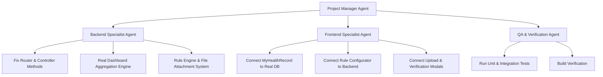

# System Design: Real Database Integration & Dashboard Calculation Fix

## Overview
This design document details the complete fix and real database integration for the **BDMS Staff Immunity & Health Registry** application (Bangkok Hospital Hat Yai). It eliminates all hardcoded/mock data, fixes missing backend endpoints, fixes the broken `getVaccinations` method call, and replaces fake dashboard metrics with real-time dynamic calculations computed directly from the Google Sheets Database (`BDMS_Staff_Immunity_Clinical_DB`, `BDMS_Staff_Immunity_Security_DB`, `BDMS_Staff_Immunity_Audit_DB`).

---

## 1. Project Management & Agent Role Strategy

To ensure absolute rigor and execution precision under `/goal`, the implementation will be managed by a **Project Manager (PM)** leading specialized subagent roles:

### Roles & Responsibilities:
1. **Project Manager (PM)**: Overall coordination, maintaining task state, verifying dependencies, and executing checkpoints.
2. **Backend Specialist**: 
   - Fix `backend/src/index.ts` `doPost` action dispatcher.
   - Implement `getVaccinations` / `getHealthRecords` in `ClinicalController.ts`.
   - Re-architect `DashboardAggregationService.ts` to compute real dynamic metrics from `STAFF`, `VACCINATION`, `LAB_RESULT`, `CHEST_XRAY`, `TB_ASSESSMENT`, `MEDICAL_ASSESSMENT`, `FILE_ATTACHMENT`, and `FILE_VERIFICATION` sheets.
   - Connect Rule Engine persistence (`RULE` and `RULE_VERSION` sheets).
3. **Frontend Specialist**:
   - Replace static JSX rows in `MyHealthRecordView.tsx` with dynamic API data.
   - Connect `RuleConfiguratorView.tsx` to backend persistence.
   - Connect `UploadModal.tsx`, `RegistryView.tsx`, and `PhysicianView.tsx` to real API endpoints.
4. **QA & Verification Specialist**:
   - Compile and build backend (`npm run build` in `backend/`).
   - Compile and build frontend (`npm run build` in `frontend/`).
   - Run tests (`npm test` in `backend/` and `frontend/`).

---

## 2. Technical Architecture & Component Changes

### 2.1 Backend Changes (`backend/src/`)

#### A. Entrypoint Router Fix (`backend/src/index.ts`)
- Add missing actions to `doPost` switch router:
  - `getHealthRecords` -> `clinicalCtrl.getHealthRecords(role, staffId, targetStaffId, requestId)`
  - `createHealthRecord` -> routes to `addVaccination` / `addLabResult` depending on category.
  - `verifyRecord` -> routes to `verifyVaccination` / `verifyFile`.
  - `addPhysicianAssessment` -> `clinicalCtrl.addPhysicianAssessment(...)`
  - `uploadFile`, `downloadFile` -> `fileCtrl.uploadFile(...)`, `fileCtrl.downloadFile(...)`
  - `createRuleVersion`, `getRules` -> `ruleCtrl` / `auditCtrl`.
  - `importStaffMaster` -> `importCtrl.importStaff(...)`

#### B. Clinical Controller Method (`backend/src/controllers/ClinicalController.ts`)
- Add missing `getHealthRecords` method that queries:
  - `VaccinationRepository.findByStaffId`
  - `LabResultRepository.findByStaffId`
  - `ChestXrayRepository.findByStaffId`
  - `TbAssessmentRepository.findByStaffId`
- Formats all records into unified `HealthRecord` objects for UI consumption.
- Add `addPhysicianAssessment` endpoint for physician reviews and medical overrides.

#### C. Dashboard Aggregation Engine (`backend/src/services/DashboardAggregationService.ts`)
Replace ALL hardcoded constants with dynamic query logic:
1. **`getCompletenessDashboard`**:
   - Evaluates each staff member against the effective Rule Version for their `WorkGroup` (CLINICAL, FRONTLINE, BACKOFFICE).
   - Computes exact `completeCount`, `incompleteCount`, `completionRate`, `workGroupBreakdown`, and `departmentBreakdown`.
   - Counts actual pending items in `FILE_VERIFICATION` for `pendingVerificationQueue`.
2. **`getFollowUpDashboard`**:
   - Calculates actual `overdueCount` by checking record expiry dates (e.g. annual Influenza/CXR, 10-year Tdap) against current date.
   - Computes `dueWithin7Days`, `dueWithin30Days`, `dueWithin60Days`.
   - Categorizes actual missing items (`vaccineRequired`, `labRequired`, `cxrRequired`, `physicianReviewRequired`).
   - Counts actual `rejectedEvidenceCount` from `FILE_VERIFICATION` and `emailFailedCount` from `NOTIFICATION_LOG`.
3. **`getProgressDashboard`**:
   - Calculates monthly completion trends based on `CreatedAt` timestamps of verified vaccinations and lab results.
   - Computes `completedActionsThisMonth`, `newActionsThisMonth`, and overdue trends dynamically.

#### D. Rule Engine Persistence (`backend/src/services/RuleVersionService.ts`)
- Implement `createDraftRuleVersion` and `getRuleHistory` to save and retrieve versioned rule configurations from `RULE` and `RULE_VERSION` sheets.

---

### 2.2 Frontend Changes (`frontend/src/`)

#### A. `MyHealthRecordView.tsx`
- Call `apiService.getHealthRecords(session.staffId)` on component mount.
- Display actual records in the table.
- Calculate Work Readiness badge (`CLEARED`, `CONDITIONALLY_CLEARED`, `NOT_CLEARED`) dynamically from backend.

#### B. `RuleConfiguratorView.tsx`
- Load active rules and drafts from API.
- Save draft rule versions to backend via API call on form submission.

#### C. `PhysicianView.tsx`
- Connect submission to `apiService.addPhysicianAssessment`.
- Update state and reload records on success.

#### D. `RegistryView.tsx` & `UploadModal.tsx`
- Ensure file upload converts file data and triggers file attachment registration.
- Enable IC/Physician to verify or reject records with instant table refresh.

---

## 3. Verification Plan

### Automated Verification
1. Run backend unit tests: `npm test` in `backend/`
2. Run esbuild backend bundle: `npm run build` in `backend/`
3. Run frontend type check and build: `npm run build` in `frontend/`

### Manual Verification
1. Verify `backend/src/Code.js` contains updated `doPost` action cases and no missing functions.
2. Verify all dashboard calculations use database query logic instead of static numbers.
3. Verify no static JSX rows remain in `MyHealthRecordView.tsx`.
